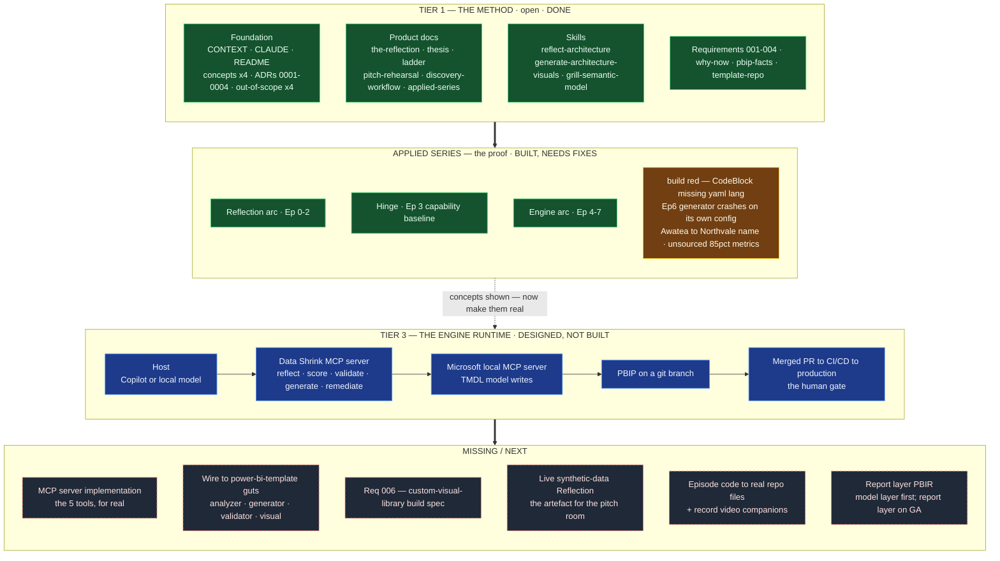

# Status Map — built · target · missing

A single picture of where The Data Shrink is right now: what is **built**, what
is **designed but not built**, and what is **missing**. Snapshot: 2026-05-26.

> Tip: this Mermaid diagram renders automatically when you view the file on
> GitHub.

## Legend

- **Green — DONE.** Written, in the repo, coherent.
- **Amber — BUILT, NEEDS FIXES.** Shipped but with known defects (see below).
- **Blue — DESIGNED, NOT BUILT.** The architecture is decided in docs/ADRs; no
  running code yet.
- **Grey/dashed — MISSING.** Not started.

## What is built

- **The Method (Tier 1):** the whole documented foundation, product narrative,
  three skills, four requirements, four ADRs, the MCP continuation design, and
  the PBIP fact base. This is the open layer — done.
- **The Applied Series:** all 8 episodes, re-grounded on the real Northvale ED
  (hospital-ER) estate, with D3 artefacts and a multi-series episode engine.

## What needs fixing (built, but defective)

1. **Build is red** — `src/components/CodeBlock.tsx` is missing the `yaml`
   entry in `HLJS_NAME`; `tsc -b` fails, so the site can't deploy.
2. **Ep 6 demo crashes** — `module_generator.py` reads config keys
   (`has_calendar_table`, `uses_datetime_join`) that `hospital_er.yaml` does not
   have, so the gate raises instead of generating the modules the prose
   promises.
3. **Editorial** — `the-development-wheel/prose.md` still says "Awatea" (should
   be Northvale); the "85% / 3–5×" metrics are sourced only to an internal file
   and should be softened for a regulated buyer.

## What is designed but not built (Tier 3 — The Engine Runtime)

The MCP aggregator: a Data Shrink MCP **server** to the host, **client** of
Microsoft's *local* MCP server, writing TMDL to a git branch where the PR/merge
is the human gate. Fully specified in
[mcp-continuation.md](../strategy/mcp-continuation.md) and ADRs 0003/0004 — but
no server code exists yet.

## What is missing

- The **MCP server implementation** (the five tools as real MCP).
- **Wiring to `power-bi-template`** — the analyzer/generator/validator/visual
  that hold the actual behaviour.
- **Requirement 006** — the custom-visual-library build spec (referenced by the
  roadmap, not yet written).
- The **live synthetic-data Reflection** artefact for the pitch room.
- Pointing episode code at the **real repo files** and recording the **video
  companions**.
- The **report layer (PBIR)** — deliberately deferred until GA; model layer
  (TMDL) first.
