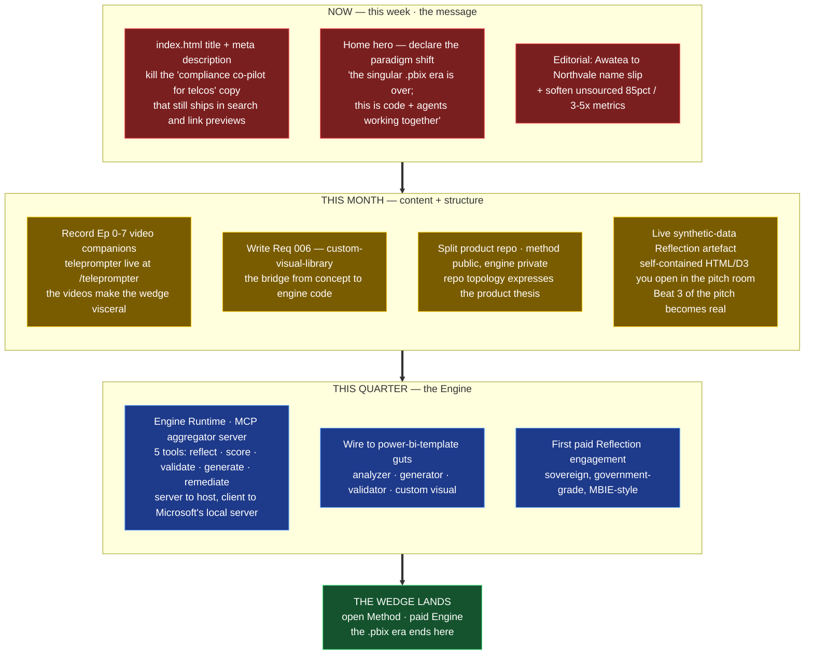

# What's Next — the path forward

Companion to [status-map.md](status-map.md). The status map is "where we are";
this is "what we do next, in what order, why."

> The thesis to land in market: **the .pbix era is ending. Power BI is becoming
> code, and humans + agents work it together.** The platform is open in
> method, paid in engine.

## Reading the diagram

- **NOW — the message.** Three small surgical fixes. The biggest single one is
  the stale `index.html` `<title>` and `<meta description>`: it still pitches a
  compliance co-pilot for AU/NZ telcos, which is the *previous* product. Every
  link preview, every SERP entry, every social share carries the wrong story
  until that's fixed. The Home hero is on-message but not yet *paradigm-shift*
  on-message — it says "optimisation," not "the .pbix era is ending."
- **THIS MONTH — content + structure.** The teleprompter is in the repo for a
  reason: record the eight episodes. In parallel, write Requirement 006
  (the build spec for the modular visual library) so the bridge from concept
  to engine code exists, split the product repo so the topology matches the
  thesis, and produce the **live, self-contained Reflection artefact** that
  makes Beat 3 of the pitch real — the moment a buyer says *"I finally see
  what we built."*
- **THIS QUARTER — the Engine.** Build the MCP aggregator server (the five
  tools), wire it to the `power-bi-template` analyzer/generator/validator, and
  land the **first paid Reflection** engagement. That engagement is the
  product-market-fit signal, and it pays for the next round.

The path through the diagram is the path the wedge takes from documented
thesis → recorded story → tangible artefact → running product → first sale.
